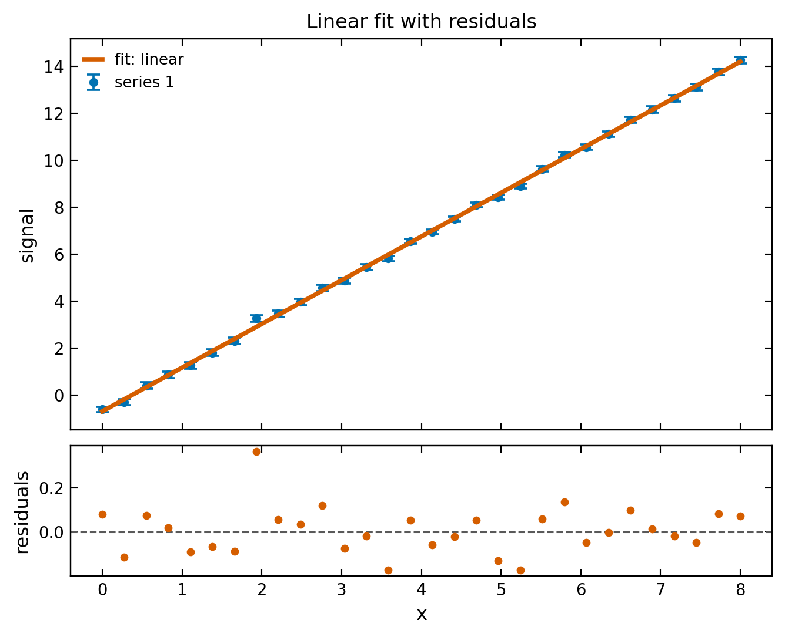
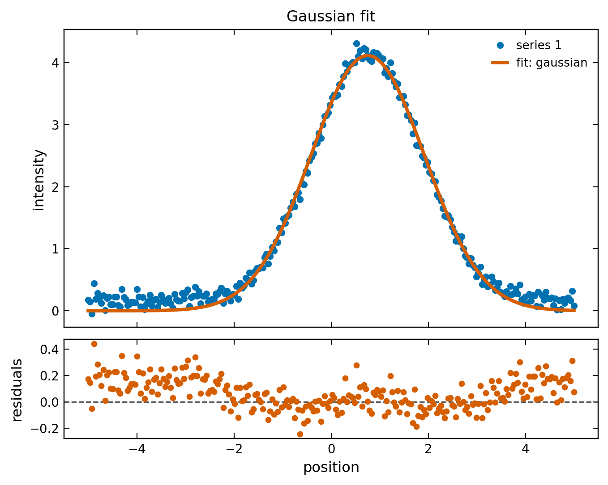
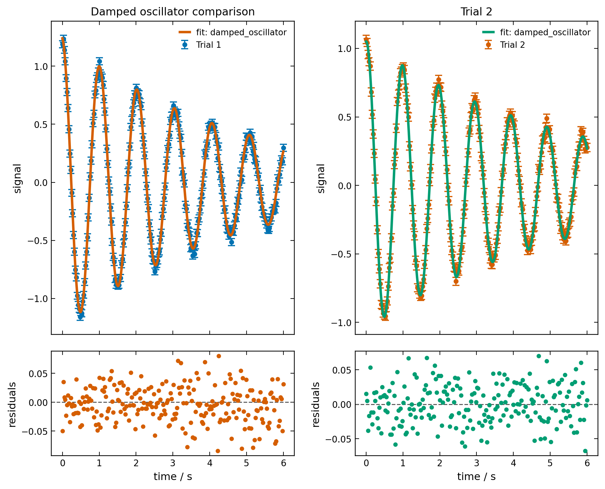
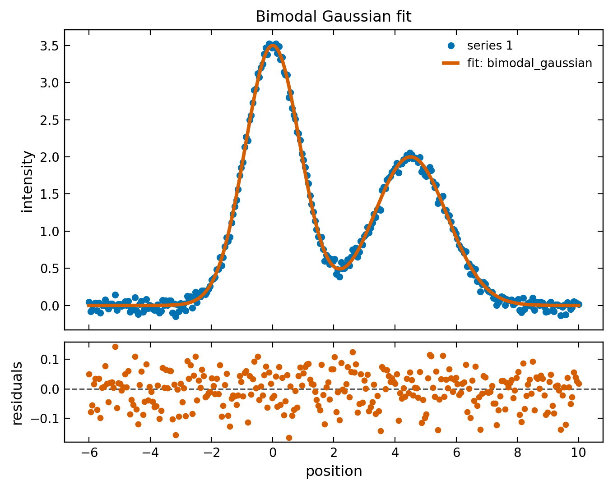
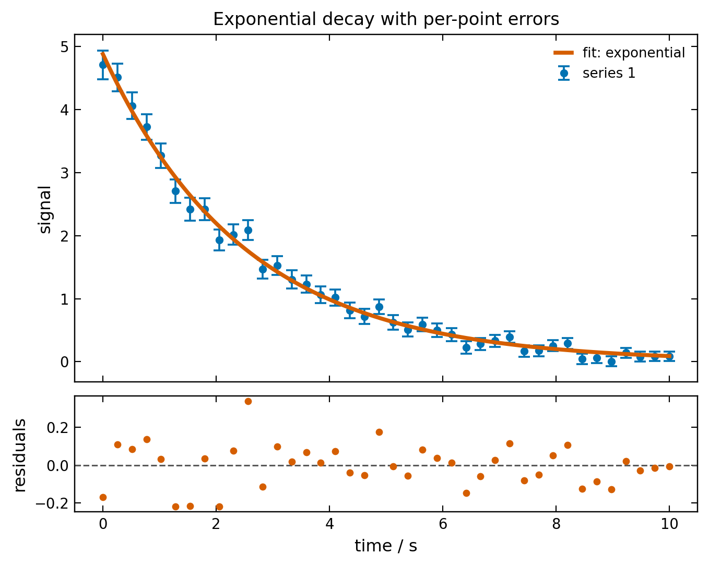
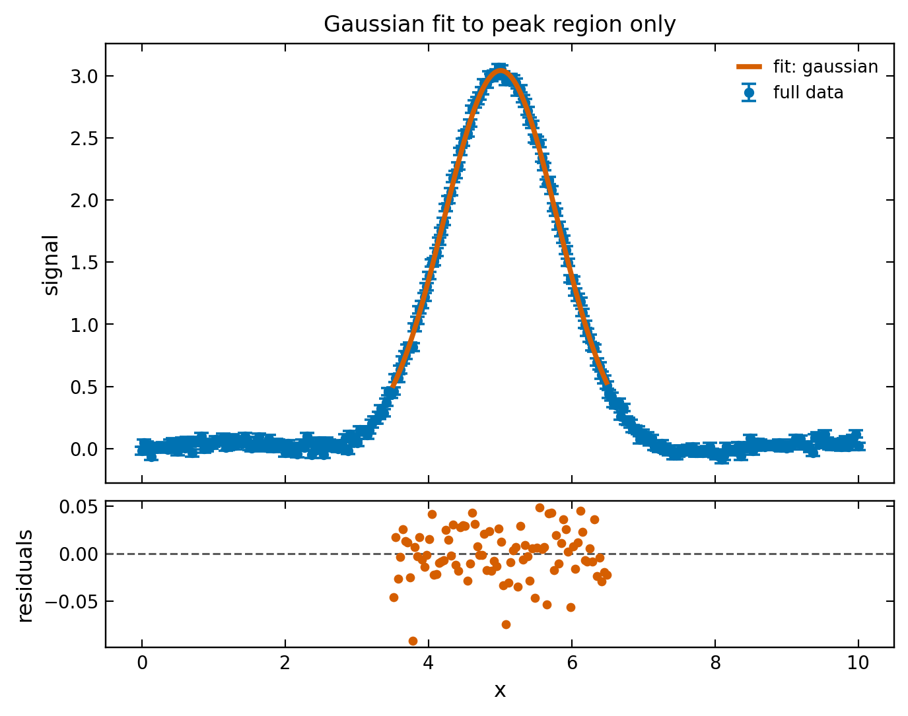

.. _gallery:

Gallery
=======

The examples below are fully reproducible and the accompanying images are
committed under ``docs/_static/gallery/``. They are generated from the same
public API you would use in your own analysis.

Linear fit with residuals
------------------------------

This example shows the core least-squares flow from raw arrays to a fit result
with uncertainties and residuals.

.. code-block:: python

   import numpy as np
   from labfit import fit_curve, plot_fit

   rng = np.random.default_rng(20240606)
   x = np.linspace(0.0, 8.0, 30)
   sigma = 0.10 + 0.02 * (1.0 + np.sin(x))
   y = 1.85 * x - 0.65 + rng.normal(0.0, sigma)

   result = fit_curve("linear", x, y, sigma)
   plot = plot_fit(result, show_residuals=True, title="Linear fit with residuals")
   plot.save("docs/_static/gallery/linear_fit.png")

   Least-squares line fit with a residual panel underneath.

Linear fit console output
~~~~~~~~~~~~~~~~~~~~~~~~~

.. code-block:: console

   slope = 1.860589 ± 0.008830
   intercept = -0.694920 ± 0.041056
   reduced chi^2 = 0.788588

Gaussian fit
------------

This example uses the built-in Gaussian model with automatic initial guesses.

.. code-block:: python

   import numpy as np
   from labfit import fit, plot_fit

   rng = np.random.default_rng(20240607)
   x = np.linspace(-5.0, 5.0, 260)
   y = 4.0 * np.exp(-0.5 * ((x - 0.75) / 1.10) ** 2) + 0.18
   y = y + rng.normal(0.0, 0.08, size=x.size)

   result = fit(x, y, model="gaussian")
   plot = plot_fit(result, show_residuals=True, title="Gaussian fit")
   plot.save("docs/_static/gallery/gaussian_fit.png")

   A standard Gaussian fit using the built-in model and automatic initial guess.

Gaussian fit console output
~~~~~~~~~~~~~~~~~~~~~~~~~~~

.. code-block:: console

   amplitude = 4.1157361 ± 0.0221282
   mean = 0.7529858 ± 0.0072789
   sigma = 1.1724581 ± 0.0072790
   reduced chi^2 = 0.0175698

Multi-series damped oscillator comparison
-----------------------------------------

This example shows :func:`labfit.fit_multi` and :func:`labfit.plot_multi_fit` on
paired experimental series.

.. code-block:: python

   import numpy as np
   from labfit import Fitter, Series, plot_multi_fit

   def damped_oscillator(t, amplitude, damping, f, phase):
       return amplitude * np.exp(-damping * t) * np.cos(2.0 * np.pi * f * t + phase)

   rng = np.random.default_rng(20240608)
   x1 = np.linspace(0.0, 6.0, 240)
   x2 = np.linspace(0.0, 6.0, 220)
   s1 = Series(x=x1, y=damped_oscillator(x1, 1.25, 0.22, 0.98, 0.10) + rng.normal(0, 0.03, size=x1.size), sigma=0.03, label="Trial 1")
   s2 = Series(x=x2, y=damped_oscillator(x2, 1.05, 0.18, 1.02, -0.05) + rng.normal(0, 0.03, size=x2.size), sigma=0.03, label="Trial 2")

   fitter = Fitter(model=damped_oscillator, p0={"amplitude": 1.0, "damping": 0.2, "f": 1.0, "phase": 0.0})
   results = fitter.fit_multi([s1, s2])
   plot = plot_multi_fit(results, [s1, s2], title="Damped oscillator comparison")
   plot.save("docs/_static/gallery/damped_oscillators.png")

   Side-by-side fit comparison with residual panels for each series.

Damped oscillator console output
~~~~~~~~~~~~~~~~~~~~~~~~~~~~~~~~

.. code-block:: console

   Trial 1
     amplitude = 1.244714 ± 0.007525
     damping = 0.219231 ± 0.002599
     f = 0.980064 ± 0.000407
     phase = 0.096056 ± 0.006038
     reduced chi^2 = 1.065382
   Trial 2
     amplitude = 1.051220 ± 0.006845
     damping = 0.183296 ± 0.002583
     f = 1.019614 ± 0.000429
     phase = -0.049326 ± 0.006753
     reduced chi^2 = 0.914054

Bimodal Gaussian fit
--------------------

This example fits a sum of two Gaussian peaks using the built-in
``bimodal_gaussian`` model.

.. code-block:: python

   import numpy as np
   from labfit import fit, plot_fit

   rng = np.random.default_rng(20260607)
   x = np.linspace(-6.0, 10.0, 300)
   y = (
       3.5 * np.exp(-0.5 * ((x - 0.0) / 0.9) ** 2)
       + 2.0 * np.exp(-0.5 * ((x - 4.5) / 1.2) ** 2)
       + rng.normal(0.0, 0.06, size=x.size)
   )

   result = fit(
       x, y, model="bimodal_gaussian",
       p0={"amplitude1": 3.0, "mean1": 0.0, "sigma1": 1.0,
           "amplitude2": 1.5, "mean2": 4.0, "sigma2": 1.0},
   )
   plot = plot_fit(result, show_residuals=True,
                   title="Bimodal Gaussian fit")
   plot.save("docs/_static/gallery/bimodal_gaussian.png")

   A two-peak Gaussian model fitted to synthetic data showing the
   fit curve and residuals.

Bimodal Gaussian fit console output
~~~~~~~~~~~~~~~~~~~~~~~~~~~~~~~~~~~~

.. code-block:: console

   amplitude1 = 3.498592 ± 0.013417
   mean1 = 0.003859 ± 0.004059
   sigma1 = 0.902587 ± 0.004157
   amplitude2 = 1.999901 ± 0.011716
   mean2 = 4.508767 ± 0.008134
   sigma2 = 1.195551 ± 0.008429
   reduced chi^2 = 0.003556

Exponential decay with per-point errors
----------------------------------------

This example fits an exponential decay where every data point has its own
y-uncertainty passed as an array. This is typical of counting-statistics
experiments (radioactive decay, photon counts, etc.) where σ ∝ √(counts).

.. code-block:: python

   import numpy as np
   from labfit import fit_curve, plot_fit

   rng = np.random.default_rng(20260608)
   x = np.linspace(0.0, 10.0, 40)

   # True model: 5.0 * exp(-0.4 * x)
   y_true = 5.0 * np.exp(-0.4 * x)

   # Per-point uncertainties vary across the dataset
   sigma = 0.05 + 0.08 * np.sqrt(y_true)
   y = y_true + rng.normal(0.0, sigma)

   result = fit_curve("exponential", x, y, sigma,
                      p0={"amplitude": 5.0, "decay": 0.5})
   plot = plot_fit(result, show_residuals=True,
                   title="Exponential decay with per-point errors",
                   xlabel="time / s", ylabel="signal")
   plot.save("docs/_static/gallery/exponential_fit.png")

   Each data point has its own uncertainty, shown by the error bars that vary
   in size across the dataset. The fit weights points accordingly.

Exponential fit console output
~~~~~~~~~~~~~~~~~~~~~~~~~~~~~~

.. code-block:: console

   amplitude = 4.880850 ± 0.100131
   decay = 0.399328 ± 0.008559
   reduced chi^2 = 0.768797

Fitting a subset of your data
-----------------------------

Fit only a region of interest (the peak) while plotting the full dataset,
including the background. This is useful when your signal has a clear
feature on top of a slowly-varying baseline.

.. code-block:: python

   import numpy as np
   from labfit import fit_curve, plot_fit, Series

   rng = np.random.default_rng(20260618)
   x = np.linspace(0.0, 10.0, 300)
   y = (3.0 * np.exp(-0.5 * ((x - 5.0) / 0.8) ** 2)
        + 0.05 * np.sin(1.5 * x)
        + rng.normal(0, 0.03, size=x.size))

   full = Series(x=x, y=y, sigma=0.03, label="full data")

   # Fit only the peak region
   mask = (x > 3.5) & (x < 6.5)
   result = fit_curve("gaussian", x[mask], y[mask], 0.03)

   plot = plot_fit(result, data_series=full,
                   title="Gaussian fit to peak region only")
   plot.save("docs/_static/gallery/subset_fit.png")

   The fit was performed only on points with ``3.5 < x < 6.5``,
   but the plot shows the full dataset with error bars.

Subset fit console output
~~~~~~~~~~~~~~~~~~~~~~~~~

.. code-block:: console

   amplitude = 3.044423 ± 0.005250
   mean = 5.010007 ± 0.001580
   sigma = 0.791448 ± 0.001760
   reduced chi^2 = 0.805082
