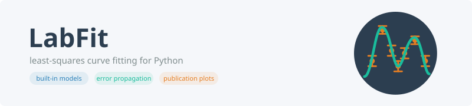

.. LabFit documentation master file.

   Homepage: https://matthewdoyle.github.io/labfit/
   Contact: matt@matthewd0yle.com
   License: MIT

Welcome to LabFit
=================

.. raw:: html

   

     <code style="background:#2c3e50; color:#fff; padding:6px 16px; border-radius:6px; font-size:1.1em; white-space:nowrap;">pip install labfit</code>
     Python ≥ 3.10
   

`LabFit` is a small, student-friendly Python library for least-squares curve fitting,
error propagation, and plotting.

It ships with built-in textbook models, convenience wrappers for quick analysis,
and a plotting layer that can show residuals and multi-series comparisons.

Core goals:

- **Reproducible workflows** from CSV to fitted curve in minutes.
- **Reduced χ² (chi-square) analysis** returned for every fit so you can immediately assess goodness-of-fit.
- **Multiple series support** - plot and fit many lines on one figure with a shared or individual axis.
- **Treat correlated and asymmetric errors correctly** without rewriting propagation code each time.
- **Complete reference docs** for fitting helpers, built-in model functions, plotting, and utilities.

.. toctree::
   :hidden:

   quickstart
   concepts
   least-squares
   fitting-functions
   api
   utilities
   gallery
   faq

.. raw:: html

   

  :ref:`quickstart`

  :ref:`concepts`

  :ref:`least-squares`

  :ref:`fitting-functions`

  :ref:`api`

  :ref:`utilities`

  :ref:`gallery`

  :ref:`faq`

.. raw:: html

   

